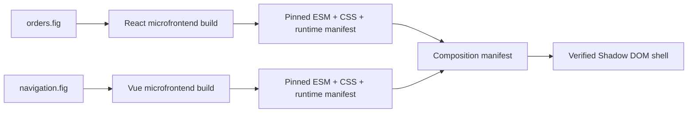

# Microfrontend Composition

OpenPencil can package an exported React or Vue application as an opt-in microfrontend. Each app
keeps its generated framework runtime and exposes the same four lifecycle functions: `bootstrap`,
`mount`, `update`, and `unmount`. A composition shell verifies each manifest and asset, then mounts
the matching apps into named slots using longest-prefix routing.

This does **not** change the normal export path. If `--packaging microfrontend` is absent,
`compile` and `build` retain their existing standalone project and static-SPA output.



## 1. Build each application

Use a stable lowercase app identity and, for released artifacts, a stable SemVer version:

```sh
openpencil build orders.fig \
  --target react \
  --packaging microfrontend \
  --app-id acme.orders \
  --app-version 1.0.0 \
  -o apps/orders

openpencil build navigation.fig \
  --target vue \
  --packaging microfrontend \
  --app-id acme.navigation \
  --app-version 1.0.0 \
  -o apps/navigation
```

Each output contains `openpencil.microfrontend.json`, one directly loadable ESM entry, optional
CSS, and a managed-build marker. Images and fonts are inlined so the manifest covers every browser
artifact. `compile` accepts the same flags when you also want the editable Vite source project.
The JSON build report includes the canonical runtime manifest's SHA-256 digest and exact byte
length, which are the coordinates required by a remote composition entry.

## 2. Describe the composition

Create `openpencil.composition.source.json` beside the application directories:

```json
{
  "format": "openpencil-microfrontend-composition",
  "schemaVersion": 1,
  "abi": "openpencil.microfrontend.v1",
  "composition": {
    "id": "acme.workspace",
    "name": "Acme Workspace",
    "version": "1.0.0"
  },
  "slots": [{ "id": "main" }, { "id": "sidebar" }],
  "apps": [
    {
      "appId": "acme.orders",
      "manifest": {
        "kind": "local",
        "path": "./apps/orders/openpencil.microfrontend.json"
      },
      "routeBase": "/orders",
      "slotId": "main"
    },
    {
      "appId": "acme.navigation",
      "manifest": {
        "kind": "local",
        "path": "./apps/navigation/openpencil.microfrontend.json"
      },
      "routeBase": "/",
      "slotId": "sidebar"
    }
  ]
}
```

At `/orders/123`, the shell mounts `acme.orders` in `main` and keeps `acme.navigation` mounted in
`sidebar`. Within one slot, the longest matching `routeBase` wins. The same route base may be used in
different slots, but not twice in one slot.

## 3. Build and preview the shell

```sh
openpencil microfrontend compose openpencil.composition.source.json \
  --base /suite/ \
  -o dist

openpencil microfrontend preview dist --base /suite/
```

Deploy `dist` as static files and configure the host to fall back to `index.html` for application
routes. `--base` must match the public sub-path used by the deployment.

The shell creates an open Shadow Root for every mounted app, injects only that app's verified CSS,
and supplies an app-local portal target for dialogs, menus, and other overlays. Navigation updates
the matching lifecycle without reloading the page; switching the winning route unmounts the old app.

## Remote manifests

A composition may point to a public HTTPS runtime manifest instead of a local path. Remote
coordinates must include the exact canonical manifest byte length and unpadded base64url SHA-256
digest. The shell fetches without credentials, rejects redirects, bounds response size and time, and
rechecks every ESM/CSS asset digest before use. The remote host must permit browser CORS.

SHA-256 provides artifact integrity, **not publisher identity**. Version 1 has no signature or
registry trust chain, private-registry credentials, Module Federation `remoteEntry`, or arbitrary
plugin installation. Use remote coordinates only for artifacts whose publisher and digest you
already trust.

The verified ESM bytes are imported through a short-lived `blob:` URL. A production Content
Security Policy must therefore allow `blob:` in `script-src` for this shell version; keep the rest
of the policy as narrow as the composed applications permit.

## Isolation and shared browser state

Shadow DOM isolates generated CSS and portal content; it is not a JavaScript security sandbox. The
apps execute as trusted modules in the same browser realm and therefore share the origin, network,
History API, cookies, and browser storage. Generated runtime registries are app-scoped and lifecycle
cleanup is explicit, but two apps can still intentionally communicate only through the host event
bus or ordinary shared backend APIs. Run untrusted third-party code in a separately designed iframe
or process boundary instead of this composition runtime.

Version 1 fails closed when an authored feature still requires a document-global runtime that cannot
be safely scoped to one mounted app. Review compiler diagnostics instead of assuming every advanced
standalone behavior can be composed. This boundary will narrow as those runtimes gain app-owned
lifecycle factories.

The v1 composition-safe surface includes ordinary generated React/Vue UI, multi-page routing,
module-local non-persisted page/document state, inlined assets, and the scoped shadcn UI-kit output.
An explicit microfrontend build currently rejects these features before adapter emission:

- the development preview bridge, i18n runtime, non-default document locale, runtime theme/design
  tokens, and standalone HTML/head/custom-CSS metadata;
- Motion, Motion drivers/scenes, prototypes, and generated effects;
- analytics, generated server workflows, and persisted document state;
- toast/confirm or authored overlays, plus the Modal, Dropdown Menu, Slide Menu, and Upload Button
  overlay modules.

Those restrictions apply only to `--packaging microfrontend`; the normal standalone export keeps
the existing behavior and generated bytes.
