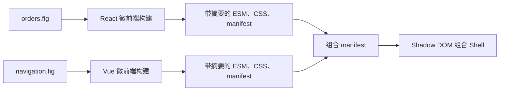

# 微前端组合

OpenPencil 可以把导出的 React 或 Vue 应用显式打包为微前端。每个应用保留自己的框架
运行时，同时实现统一的 `bootstrap`、`mount`、`update`、`unmount` 生命周期。组合 Shell
会先校验 manifest、ESM 与 CSS，再按“命名插槽 + 最长路由前缀”挂载多个应用。

这不会改变原有导出：没有传入 `--packaging microfrontend` 时，`compile` 与 `build` 仍走
原来的 standalone 路径，输出保持兼容。



## 1. 分别构建应用

```sh
openpencil build orders.fig \
  --target react \
  --packaging microfrontend \
  --app-id acme.orders \
  --app-version 1.0.0 \
  -o apps/orders

openpencil build navigation.fig \
  --target vue \
  --packaging microfrontend \
  --app-id acme.navigation \
  --app-version 1.0.0 \
  -o apps/navigation
```

每个目录会包含 `openpencil.microfrontend.json`、一个可直接加载的 ESM 入口、可选 CSS
以及受管构建标记。图片和字体会内联，因此 manifest 能覆盖全部浏览器产物。需要可编辑的
Vite 源码时，`compile` 也接受同样的参数。`build --json` 还会返回 runtime manifest 的
SHA-256 和精确字节数；远程组合条目应使用这两个坐标。

## 2. 编写组合 manifest

在 `apps` 同级创建 `openpencil.composition.source.json`：

```json
{
  "format": "openpencil-microfrontend-composition",
  "schemaVersion": 1,
  "abi": "openpencil.microfrontend.v1",
  "composition": {
    "id": "acme.workspace",
    "name": "Acme Workspace",
    "version": "1.0.0"
  },
  "slots": [{ "id": "main" }, { "id": "sidebar" }],
  "apps": [
    {
      "appId": "acme.orders",
      "manifest": {
        "kind": "local",
        "path": "./apps/orders/openpencil.microfrontend.json"
      },
      "routeBase": "/orders",
      "slotId": "main"
    },
    {
      "appId": "acme.navigation",
      "manifest": {
        "kind": "local",
        "path": "./apps/navigation/openpencil.microfrontend.json"
      },
      "routeBase": "/",
      "slotId": "sidebar"
    }
  ]
}
```

访问 `/orders/123` 时，`acme.orders` 会挂到 `main`，`acme.navigation` 会持续挂在
`sidebar`。同一插槽内由最长 `routeBase` 获胜；不同插槽可以使用相同路由前缀。

## 3. 构建与预览 Shell

```sh
openpencil microfrontend compose openpencil.composition.source.json \
  --base /suite/ \
  -o dist

openpencil microfrontend preview dist --base /suite/
```

部署 `dist` 时，需要把应用路由回退到 `index.html`，并确保 `--base` 与线上子路径一致。
Shell 为每个应用创建独立的 open Shadow Root，将校验后的 CSS 和 portal 目标放在对应
Shadow Root 内；路由变化会触发 `update`，切换应用时会执行 `unmount`。

## 远程 manifest 与安全边界

组合文件也可以引用公共 HTTPS runtime manifest，但必须提供原始 manifest 的精确字节数
和 base64url SHA-256。Shell 无凭证拉取、拒绝重定向，并对 manifest、ESM 和 CSS 做超时、
大小、摘要复核；远端还必须允许浏览器 CORS。

SHA-256 只证明“内容没有偏离指定摘要”，不证明发布者身份。v1 没有签名信任链、私有仓库
凭据、Module Federation `remoteEntry` 或任意插件安装能力。只应加载你已信任来源和摘要的
OpenPencil 生成产物。

校验后的 ESM 会通过短生命周期的 `blob:` URL 导入，因此这一版 Shell 的生产 CSP 需要在
`script-src` 中允许 `blob:`；其余策略仍应按组合应用的实际需求尽量收紧。

Shadow DOM 提供样式与 overlay 隔离，但不是 JavaScript 安全沙箱。多个应用仍共享浏览器
origin、网络、History API、Cookie 与存储；受信应用通过 host event bus 或共同后端协作。
不受信任的第三方代码应使用另行设计的 iframe 或进程隔离方案。

如果某个已创作功能仍依赖无法安全限定到单个应用的 document 全局运行时，v1 会拒绝该
微前端构建。请检查编译诊断，不要假定所有 standalone 高级行为都能直接组合；后续这些
运行时改为应用自有的生命周期 factory 后，限制会逐步收窄。

v1 的可组合安全子集包括普通 React/Vue 界面、多页路由、应用模块内的非持久 page/document
state、内联资源，以及已限定到 Shadow Root 的 shadcn UI kit。显式微前端构建目前会在
adapter 生成代码前拒绝：

- 开发预览 bridge、i18n、非默认文档语言、运行时主题/设计 token，以及 standalone 专用的
  HTML/head/custom CSS metadata；
- Motion、Motion driver/scene、prototype 与 generated effect；
- analytics、生成式 server workflow 和持久化 document state；
- toast/confirm、自定义 overlay，以及 Modal、Dropdown Menu、Slide Menu、Upload Button
  这四个 overlay module。

这些限制只作用于 `--packaging microfrontend`；普通 standalone 导出继续保留原有行为与
生成字节。
