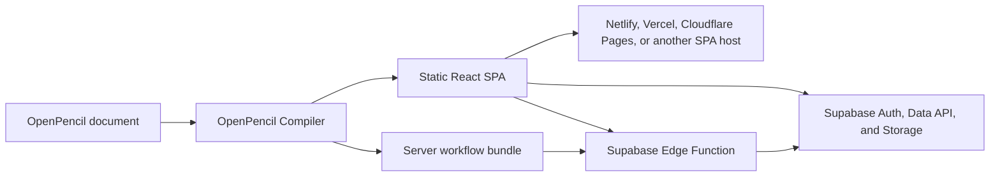

# Application Runtime Guide

This guide takes an OpenPencil lowcode document from an interactive design to a production-ready
application. It focuses on the operational path: Supabase configuration, authenticated CRUD, Row
Level Security (RLS), server workflows, environment separation, static hosting, and production
troubleshooting.

For a reference to every authoring control and action, see [Lowcode Apps](./lowcode-apps). You can
also reopen this page from **Help → Application Runtime Guide** in OpenPencil.

::: warning Production boundary
OpenPencil can validate the document, generate reviewable RLS suggestions, build the browser app,
and emit a server-workflow bundle. It does not change your database, prove that an RLS policy is
live, configure production secrets, or deploy the server bundle automatically. Those remain
explicit operator actions.
:::

## What You Will Deploy

An application with server workflows has two independently deployed artifacts:



| Artifact                    | Contains                                                                             | Deployment owner                                                          |
| --------------------------- | ------------------------------------------------------------------------------------ | ------------------------------------------------------------------------- |
| Browser SPA                 | React UI, routes, public Supabase configuration, client workflows, and static assets | OpenPencil deploy command or your static host                             |
| Supabase project            | Auth users, Postgres tables, grants, RLS policies, and Storage buckets               | Your database migrations or Supabase Dashboard                            |
| `openpencil-server/`        | Authenticated server workflows and a manifest of required environment names          | You, through the Supabase CLI                                             |
| Provider and server secrets | Hosting tokens and third-party API credentials                                       | Your credential store, CI secret store, or Supabase Edge Function secrets |

The browser and server artifacts can be released separately. A successful static deployment does
not mean the server workflows are live.

## Prerequisites

Before starting, prepare:

- A saved `.fig` or `.pen` document. Saving gives preview and deployment settings a stable document
  identity.
- The OpenPencil desktop app for the live preview sidecar and Deploy panel. Browser editing is
  supported, but those two features are desktop-only.
- A Supabase project if the app uses Auth, database data, Storage, or server workflows.
- The project URL and a publishable key (or legacy `anon` key) for the browser runtime.
- A Supabase personal access token only if you want the editor to inspect the database schema.
- A Netlify, Vercel, or Cloudflare token if you use OpenPencil's direct static deployment.
- The [Supabase CLI](https://supabase.com/docs/reference/cli/getting-started) if the document contains
  server workflows.

::: danger Never use an elevated key in the client
Do not put an `sb_secret_...` or legacy `service_role` key in the document, generated SPA, command
line, or `VITE_SUPABASE_*` variables. OpenPencil rejects known elevated keys at client-build
boundaries. A browser key is public by design; database access must be protected with grants, Auth,
and RLS.
:::

## 1. Model the Application Before Connecting Data

Start with a small vertical slice that proves routing and state before adding external services:

1. Give each application page a unique route.
2. Create the Inputs, Buttons, Forms, Lists, and status text the flow needs.
3. Bind every validated form control to page or document state. The Bindings inspector can create a
   compatible page state for an unbound control.
4. Add visible loading, success, empty, and error states. Do not rely on console output as the only
   user feedback.
5. Preview navigation, form validation, and local state changes.

For a data list, create an array-valued **Document State** such as `tasks`, then select the LIST and
set its source to that document state. The first visible child of the LIST becomes the row template;
bindings inside it can reference the configured item and index names.

## 2. Prepare a User-Scoped Supabase Table

The following `tasks` table is a compact example for exercising sign-in, reads, inserts, updates,
and deletes. Apply schema changes through a reviewed migration or the Supabase SQL editor:

```sql
create table public.tasks (
  id bigint generated always as identity primary key,
  user_id uuid not null references auth.users(id) on delete cascade default auth.uid(),
  title text not null check (char_length(title) between 1 and 200),
  completed boolean not null default false,
  created_at timestamptz not null default now()
);

alter table public.tasks enable row level security;

grant select, insert, update, delete
on table public.tasks
to authenticated;

create policy "Users can read their own tasks"
on public.tasks for select
to authenticated
using ((select auth.uid()) = user_id);

create policy "Users can create their own tasks"
on public.tasks for insert
to authenticated
with check ((select auth.uid()) = user_id);

create policy "Users can update their own tasks"
on public.tasks for update
to authenticated
using ((select auth.uid()) = user_id)
with check ((select auth.uid()) = user_id);

create policy "Users can delete their own tasks"
on public.tasks for delete
to authenticated
using ((select auth.uid()) = user_id);
```

This is a starter policy set, not a universal authorization model. Review ownership, roles,
multi-tenant boundaries, retention, audit logging, and indexes for your application. Supabase
documents that exposed tables need RLS, and that an UPDATE also needs a corresponding SELECT
policy. See [Row Level Security](https://supabase.com/docs/guides/database/postgres/row-level-security)
and [Securing your API](https://supabase.com/docs/guides/api/securing-your-api).

## 3. Configure Supabase in OpenPencil

Clear the canvas selection to show the document-level properties, then open **Supabase**.

1. Enter the project URL, for example `https://your-project.supabase.co`.
2. Enter the publishable or legacy `anon` key.
3. Keep the schema as `public`, or enter another exposed schema.
4. Select **Test connection**. This checks that the URL is reachable and the public key is accepted;
   it does not prove that any table, grant, or RLS policy is correct.

::: tip Configure the document before building
The design needs a valid Supabase configuration before compilation so the compiler can discover and
emit its Supabase and server-workflow runtimes. Build and deploy overrides replace environment
values; they do not retroactively add a runtime that was omitted from an unconfigured design.
:::

### Configuration and secret locations

| Value                                | Public? | Stored in the design? | Correct location                                                                       |
| ------------------------------------ | ------- | --------------------- | -------------------------------------------------------------------------------------- |
| Supabase project URL                 | Yes     | Yes                   | Document Supabase panel or per-environment build override                              |
| Publishable / legacy `anon` key      | Yes     | Yes                   | Document Supabase panel or per-environment build override                              |
| Supabase personal access token       | No      | No                    | OpenPencil credential store, for Schema Inspector only                                 |
| `sb_secret_...` / `service_role` key | No      | Never                 | Not used by the generated OpenPencil runtime                                           |
| Static-host provider token           | No      | No                    | Deploy dialog for the current operation, CLI environment, or CI secret store           |
| Third-party server credential        | No      | Name only             | Supabase Edge Function secrets; the document stores only its environment-variable name |

### Inspect the live schema safely

The **Database schema** inspector uses the Supabase Management API. Paste a Supabase personal
access token, save it to the unified credential store, then select **Inspect schema**.

The inspector stores neither the token nor the raw Management API response in the document. Its
local cache contains a bounded, normalized catalog of tables, columns, and relations. Use that
catalog to catch misspelled table and column names before deployment, but refresh it after database
migrations.

Live inspection has a 15-second timeout and a 4 MiB response limit. The normalized local cache is
limited to 512 KiB and expires after 15 minutes. Deploy preflight reads a still-valid cache; it does
not silently make a fresh Management API request. Current readiness comparison verifies referenced
table names, not every column type or relation. The inspector recognizes hosted
`https://<project-ref>.supabase.co` projects; a valid self-hosted runtime URL can still be used by the
generated app, but it cannot currently be resolved through this hosted-project inspector.

The PAT is separate from the browser key:

- The browser key runs the generated app and is constrained by Auth, grants, and RLS.
- The PAT lets the editor read management metadata. It must never become a browser runtime value.

## 4. Add Authenticated CRUD

Build one complete flow before expanding the application.

| Action         | Required database access                       | Authoring constraints                                                  |
| -------------- | ---------------------------------------------- | ---------------------------------------------------------------------- |
| Query / LIST   | `SELECT`                                       | Static table and columns; optional filters; single row or array result |
| Insert         | `INSERT`                                       | Payload entries or static JSON payload                                 |
| Update         | `SELECT` + `UPDATE`                            | Payload plus at least one filter                                       |
| Delete         | `SELECT` + `DELETE`                            | At least one filter and no payload                                     |
| Upsert         | `SELECT` + `INSERT` + `UPDATE`                 | Payload entries or static JSON payload                                 |
| Storage upload | Bucket-specific `SELECT` + `INSERT` + `UPDATE` | Controlled file Input and reviewed Storage policy                      |

Supabase filters support `eq`, `neq`, `gt`, `gte`, `lt`, `lte`, `like`, and `in`. Table and column
names are static configuration, and values use OpenPencil's bounded expression language rather than
arbitrary JavaScript or SQL. The runtime does not author migrations, arbitrary SQL, database RPCs,
Realtime subscriptions, or service-role operations.

### Authentication

1. Bind email and password Inputs to controlled state.
2. Add a **Supabase auth** action to the relevant button or form event.
3. Choose `signUp`, `signIn`, `signOut`, `resetPassword`, or `updatePassword`.
4. Write failures to a visible error target.
5. Use `$currentUser.signedIn`, `$currentUser.id`, and `$currentUser.email` in bindings and render
   conditions.

With email confirmation enabled in Supabase, sign-up may not create a session until the user
confirms the email. Test password-reset return links on a real deployment because preview only sends
the reset request.

### Read rows

1. Create an array Document State such as `tasks` and an error state such as `tasksError`.
2. Add a **Supabase query** action to a page-load or explicit refresh event.
3. Set table `tasks`, columns such as `id,title,completed,created_at`, and result target `tasks`.
4. Set the error target to `tasksError`.
5. Point the LIST at `tasks` and bind row text to fields on the LIST item.

RLS should apply the user filter. Adding `user_id = $currentUser.id` in the client can reduce
unnecessary rows, but it is not an authorization boundary and never replaces the database policy.

### Insert, update, and delete

Use **Supabase mutation** actions:

- `insert` and `upsert` need payload entries.
- `update` and `delete` need at least one filter; OpenPencil rejects an unbounded write.
- Set result and error targets when the UI needs to display the outcome.
- In `onSuccess`, refresh the query or update the bound state so the interface reflects the write.
- In `onError`, show a useful error message and keep the user's form values available for retry.

For the sample table, the database default can populate `user_id` from `auth.uid()`. The INSERT RLS
policy still verifies that the resulting row belongs to the caller.

## 5. Review RLS and Schema Readiness

The document-level RLS advisor scans client events, named client workflows, LIST queries, Storage
uploads, and server-workflow database actions. It groups required operations by table and can copy
starter SQL.

Treat the generated SQL as a review prompt:

1. Compare every required operation with the product's authorization rules.
2. Apply the final policy through a migration or the Supabase Dashboard.
3. Test with an unauthenticated client, an authenticated owner, and a second authenticated user.
4. Confirm that UPDATE and DELETE cannot affect another user's rows.
5. Re-run the schema inspection and runtime audit after migrations.

Generic advisor templates can contain permissive predicates such as `(true)` and grants for `anon`
and `authenticated`. Never apply those unchanged merely because they compile. Replace them with the
application's ownership, tenant, and role rules. Storage templates constrain the bucket, but still
need an explicit ownership model.

The built-in AI and MCP expose the same read-only audit:

```json
{
  "tool": "audit_application_runtime",
  "arguments": {
    "environment": "production",
    "known_tables": ["tasks"],
    "rls_verified": true,
    "server_workflows_deployed": false
  }
}
```

Only set `known_tables`, `rls_verified`, or `server_workflows_deployed` from checks you actually
performed. The tool never reads secret values and does not query live RLS or deployment state. Its
report includes effective configuration readiness, required table operations, schema mismatches,
server validation errors, required server environment **names**, and remaining deployment work.

`ready: true` means the audit found no blocking error. Warnings can still include unverified schema,
unverified RLS, missing server environment configuration, or a server bundle that still needs
deployment. The `environment` argument changes validation rules, such as requiring HTTPS for
production; it does not select or deploy a real infrastructure target.

## 6. Use Server Workflows for Secret-Bearing Operations

A client action is suitable for operations that are safe under the caller's Supabase session and
RLS. Use a server workflow when the operation needs a private third-party credential, protected
orchestration, or server-side response shaping.

The first server runtime is intentionally narrow:

- Every endpoint is an authenticated Supabase-user `POST` request.
- Supported steps are HTTPS request, Supabase query, Supabase mutation, condition, return, and call
  another validated server workflow.
- Supabase access reuses the caller's bearer token, so database operations remain subject to the
  caller's RLS policies.
- Sensitive headers and other private values reference uppercase environment-variable names.
- Literal secrets, unknown fields, recursive calls, unsafe URLs, private-network destinations,
  redirects, oversized requests/responses, and unbounded update/delete actions are rejected.
- The generated runtime does not create or use a service-role client.

Invocation bodies are limited to 64 KiB. Each outbound HTTP request is HTTPS-only, has an 8-second
timeout, refuses redirects, and limits the response to 1 MiB. Sensitive headers must come from
environment references, and callers cannot dynamically select an outbound URL. Hostname checks are
not a DNS-resolution egress firewall; use platform network controls when the threat model requires
one. The generated CORS response allows all origins, so applications with a strict origin policy
should review and narrow it before deployment.

This contract is not intended for anonymous webhooks, cron jobs, admin bypasses, or long-running
background work.

### Author and invoke a workflow

Server definitions are currently managed through built-in AI or MCP:

- `read_server_workflows` returns the current validated definitions.
- `set_server_workflows` atomically replaces them with a native array. Use the legacy
  `server_workflows_json` input only when the client cannot send structured arrays.

A minimal definition looks like this:

```json
[
  {
    "id": "notify-user",
    "name": "Notify user",
    "trigger": { "kind": "http", "method": "POST", "auth": "supabase-user" },
    "params": ["message"],
    "actions": [
      {
        "id": "send-message",
        "kind": "httpRequest",
        "method": "POST",
        "url": { "kind": "expr", "expr": "\"https://api.example.com/messages\"" },
        "headers": [
          {
            "name": "Authorization",
            "value": { "kind": "env", "name": "MESSAGES_API_TOKEN" }
          }
        ],
        "body": { "kind": "expr", "expr": "message" },
        "resultName": "providerResult"
      },
      {
        "id": "return-result",
        "kind": "return",
        "valueExpr": "providerResult",
        "status": 200
      }
    ]
  }
]
```

On a Button, Form, or another event source, add **Invoke server workflow**, select `notify-user`, map
its `message` argument, and add success and error branches. The generated browser runtime invokes a
single `openpencil-runtime` Edge Function with `{ workflowId, args }` after obtaining the current
Supabase session.

## 7. Preview and Run the Preflight Audit

Open the desktop preview after each vertical slice. Verify:

- Routes and refresh behavior.
- Signed-out, sign-up confirmation, sign-in, and sign-out states.
- Loading, empty, success, validation, and network-error states.
- Reads and writes as two different users.
- Server-workflow success, rejected input, missing session, and downstream failure paths.

The Deploy panel runs the Application Runtime preflight before starting a build. Resolve errors
before deployment and review every warning. Preview, staging, and production targets are stored
separately for the current document. A Save As document and a remote document binding receive
separate target histories.

Per-environment Supabase values are passed to the child build through an explicit private channel.
Unrelated ambient `VITE_SUPABASE_*` values cannot silently replace the selected target.

## 8. Build a Production Bundle

Build all pages as a static SPA:

```sh
bun open-pencil build app.fig -o dist \
  --supabase-url https://your-project.supabase.co \
  --supabase-anon-key "$SUPABASE_PUBLISHABLE_KEY" \
  --supabase-schema public
```

You can use `VITE_SUPABASE_URL`, `VITE_SUPABASE_ANON_KEY`, and `VITE_SUPABASE_SCHEMA` instead. An
explicit flag wins over its matching environment variable. URL and key overrides must be supplied
together so values from two projects cannot be mixed.

Useful options include:

- `--page <name>` to emit one page instead of the full routed app.
- `--base /subpath/` when hosting below the domain root.
- `--ui-kit shadcn` for supported shadcn/ui output.
- `--i18n --locale fr --locale de` for localized output.
- `--json` for a machine-readable build summary.

When server workflows exist, the output is split:

```text
dist/
├── index.html
├── assets/
└── openpencil-server/
    ├── supabase/functions/openpencil-runtime/index.ts
    ├── .env.server.example
    ├── openpencil-server.manifest.json
    └── SERVER_DEPLOYMENT.md
```

The static host should receive `index.html` and browser assets, not `openpencil-server/`.

If server workflow validation fails, or the design lacks a valid Supabase configuration, the
compiler omits server artifacts and emits a secret-free warning. Fix that warning before assuming a
build is complete. `compile` emits the same server sources beside the generated React project;
`build` preserves them under `<out>/openpencil-server/` without sending them through Vite.

## 9. Deploy the Static SPA

OpenPencil supports direct deployment to Netlify, Vercel, and Cloudflare Pages:

```sh
NETLIFY_AUTH_TOKEN=... \
bun open-pencil deploy app.fig \
  --provider netlify \
  --environment production \
  --site my-site
```

```sh
VERCEL_TOKEN=... \
bun open-pencil deploy app.fig \
  --provider vercel \
  --environment production \
  --site my-project
```

```sh
CLOUDFLARE_API_TOKEN=... \
bun open-pencil deploy app.fig \
  --provider cloudflare \
  --environment production \
  --account-id <account-id> \
  --site my-pages-project
```

Add the same Supabase override flags used by `build` when production must not use the values stored
in the design. The `--environment` value labels the deployment record; provider targeting still
comes from `--site` and provider-specific settings.

For a multi-page app, configure the provider to serve `index.html` for unknown routes. Otherwise a
direct visit or refresh on `/settings` can return a host-level 404 even though in-app navigation
works.

If server workflows exist, `deploy` uploads only the browser files and prints a separate manual
server-deployment recipe.

A static rollback affects only the browser deployment. It does not roll back the Edge Function,
database migrations, RLS policies, or environment values; coordinate those changes as separate
release artifacts.

## 10. Deploy the Server Workflow Bundle

Review the generated function and manifest before deployment:

```sh
less dist/openpencil-server/SERVER_DEPLOYMENT.md
less dist/openpencil-server/openpencil-server.manifest.json
```

The manifest lists workflow IDs, parameters, the authentication contract, and required environment
variable names. Never put populated secrets in `.env.server.example` or commit a copied secret
file.

Hosted Supabase Edge Functions provide `SUPABASE_URL` and the legacy `SUPABASE_ANON_KEY` by default.
Set only the additional environment names referenced by your workflows, either in the Dashboard or
through the CLI:

```sh
supabase login
supabase secrets set MESSAGES_API_TOKEN=... --project-ref <project-ref>
```

Then deploy the generated function:

```sh
supabase functions deploy openpencil-runtime \
  --project-ref <project-ref> \
  --workdir dist/openpencil-server
```

The [Supabase Edge Functions quickstart](https://supabase.com/docs/guides/functions/quickstart)
documents CLI authentication and deployment. The
[environment-variable guide](https://supabase.com/docs/guides/functions/secrets) covers local and
production secrets.

After deployment:

1. Sign in through the generated app.
2. Invoke each workflow through its real UI event.
3. Inspect the browser request and Edge Function logs without printing tokens or secret values.
4. Confirm that the workflow cannot read or mutate another user's rows.
5. Re-run `audit_application_runtime` with `server_workflows_deployed: true` only after the target
   function is live.

## Troubleshooting

| Symptom                                             | Likely cause                                                                     | What to check                                                                                           |
| --------------------------------------------------- | -------------------------------------------------------------------------------- | ------------------------------------------------------------------------------------------------------- |
| **Test connection** fails                           | Invalid URL, wrong public key, offline project, or network/CORS failure          | Copy the URL and publishable/anon key from the same Supabase project; never substitute a secret key     |
| Schema Inspector says the credential is missing     | PAT was not saved or credential storage is locked/unavailable                    | Save a Supabase personal access token and unlock the operating-system credential store                  |
| Schema inspection returns forbidden/not found       | PAT cannot access the project or the URL points to another project               | Confirm the PAT account, organization membership, and project reference                                 |
| Query succeeds but returns zero rows                | RLS hides the rows, the user is signed out, or the filter is wrong               | Test `$currentUser`, policy `USING`, grants, and the same query as the affected user                    |
| INSERT is rejected                                  | Missing grant, RLS `WITH CHECK`, required column, or invalid payload             | Inspect the Supabase error target and test the final row against the INSERT policy                      |
| UPDATE changes nothing                              | Missing SELECT visibility, UPDATE policy, or matching filter                     | Add the required SELECT policy and confirm the filter selects an owned row                              |
| OpenPencil rejects the key                          | An elevated `sb_secret_...` or `service_role` key was entered                    | Replace it with a publishable or legacy `anon` key and rotate the elevated key if it was exposed        |
| Preview works but production uses the wrong project | Production overrides were omitted or point to a different project                | Supply URL and public key together through flags or the matching `VITE_SUPABASE_*` variables            |
| Preview is unavailable                              | The browser app cannot start the local compiler sidecar                          | Use the desktop app or build through the CLI                                                            |
| Server action returns 401                           | No valid signed-in Supabase session reached the function                         | Sign in, verify the session, and keep JWT verification enabled for this generated contract              |
| Server action returns 400                           | Workflow ID/arguments do not match, or the request exceeds 64 KiB                | Compare the invocation with the generated manifest and reduce the payload                               |
| Server action returns a generic 500                 | Missing environment name, rejected outbound target, timeout, or downstream error | Compare Edge Function secrets with the manifest and inspect sanitized function logs                     |
| No server bundle was generated                      | Invalid server definitions or missing design-level Supabase config               | Resolve compiler warnings, configure the document, and rebuild                                          |
| Static deploy succeeds but server action fails      | Static hosting never deployed `openpencil-server/`                               | Deploy `openpencil-runtime` separately and then mark the audit flag                                     |
| A routed page 404s after refresh                    | The host lacks SPA fallback                                                      | Rewrite unknown paths to `index.html`                                                                   |
| Cloudflare deploy stops before upload               | Account or Pages project target is missing                                       | Pass `--account-id`, set `CLOUDFLARE_ACCOUNT_ID`, or use an account/project target supported by the CLI |

## Production Checklist

Before announcing a release, confirm all of the following:

- [ ] Every validated control is bound and every user-visible async action has an error state.
- [ ] Routes, direct refreshes, auth redirects, and password-reset return links work on the real host.
- [ ] The production project URL and public key are explicit and belong to the same project.
- [ ] No elevated Supabase key, provider token, PAT, or third-party secret exists in the design or
      browser bundle.
- [ ] The inspected schema is current and all referenced tables and columns exist.
- [ ] Grants and RLS policies were reviewed, applied, and tested with at least two users.
- [ ] The Application Runtime audit has no unresolved errors; verification flags reflect real checks.
- [ ] Static hosting has an SPA fallback and the correct `--base` path.
- [ ] `openpencil-server/` was excluded from static upload.
- [ ] Every required server environment name is configured in the target Supabase project.
- [ ] The generated Edge Function was reviewed, deployed, and exercised from the real application.
- [ ] Provider and function logs are usable without exposing credentials or personal data.

Keep the browser and server releases traceable to the same saved document revision. If either side
changes, repeat the audit and the affected deployment instead of assuming the previous verification
still applies.
