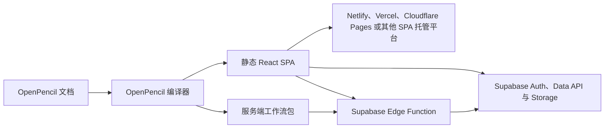

# 应用运行时指南

本指南将帮助你把一份可交互的 OpenPencil 低代码文档转化为可投入生产的应用。内容聚焦于实际运维路径：Supabase 配置、经过身份验证的 CRUD、行级安全（Row Level Security，RLS）、服务端工作流、环境隔离、静态托管，以及生产环境故障排查。

如需查阅每一项创作控件与动作，请参阅[低代码应用](/zh-cn/user-guide/lowcode-apps)。你也可以在 OpenPencil 中通过**帮助 → 应用运行时指南**重新打开此页面。

::: warning 生产边界
OpenPencil 可以校验文档、生成可供审查的 RLS 建议、构建浏览器应用，并产出服务端工作流包。它不会修改你的数据库、证明某条 RLS 策略已经生效、配置生产密钥，也不会自动部署服务端包。这些仍然是需要操作者明确执行的步骤。
:::

## 你将部署什么

包含服务端工作流的应用会生成两个需要独立部署的产物：



| 产物                 | 包含内容                                                     | 部署负责人                                                 |
| -------------------- | ------------------------------------------------------------ | ---------------------------------------------------------- |
| 浏览器 SPA           | React UI、路由、公开的 Supabase 配置、客户端工作流和静态资源 | OpenPencil 部署命令或你的静态托管平台                      |
| Supabase 项目        | Auth 用户、Postgres 表、授权、RLS 策略和 Storage 存储桶      | 你的数据库迁移或 Supabase Dashboard                        |
| `openpencil-server/` | 经过身份验证的服务端工作流，以及所需环境变量名称清单         | 由你通过 Supabase CLI 部署                                 |
| 平台和服务端密钥     | 托管平台令牌与第三方 API 凭据                                | 你的凭据存储、CI 密钥存储或 Supabase Edge Function secrets |

浏览器产物与服务端产物可以分别发布。静态部署成功，并不意味着服务端工作流已经上线。

## 准备工作

开始之前，请准备：

- 一份已保存的 `.fig` 或 `.pen` 文档。保存操作会为预览与部署设置提供稳定的文档标识。
- OpenPencil 桌面应用，用于运行实时预览 sidecar 和 Deploy（部署）面板。浏览器端支持编辑，但这两项功能目前仅限桌面端。
- 如果应用使用 Auth、数据库数据、Storage 或服务端工作流，则需要一个 Supabase 项目。
- 浏览器运行时所需的项目 URL，以及 publishable key（或旧版 `anon` key）。
- 仅当你希望编辑器检查数据库 schema 时，才需要 Supabase personal access token（PAT）。
- 如果使用 OpenPencil 直接部署静态站点，则需要 Netlify、Vercel 或 Cloudflare 令牌。
- 如果文档包含服务端工作流，则需要安装 [Supabase CLI](https://supabase.com/docs/reference/cli/getting-started)。

::: danger 切勿在客户端使用高权限密钥
不要把 `sb_secret_...` 或旧版 `service_role` key 放入文档、生成的 SPA、命令行或 `VITE_SUPABASE_*` 变量。OpenPencil 会在客户端构建边界拒绝已知的高权限密钥。浏览器 key 在设计上就是公开的；数据库访问必须通过授权、Auth 与 RLS 保护。
:::

## 1. 连接数据之前先建立应用模型

先实现一个小型纵向切片，在引入外部服务前验证路由与状态：

1. 为每个应用页面设置唯一的路由。
2. 创建流程所需的 Input、Button、Form、List 和状态文本。
3. 将每个需要校验的表单控件绑定到页面状态或全局状态。对于尚未绑定的控件，绑定检查器可以创建兼容的页面状态。
4. 添加可见的加载、成功、空数据和错误状态。不要把控制台输出作为唯一的用户反馈。
5. 预览导航、表单校验与本地状态变化。

对于数据列表，请创建一个数组类型的**全局状态**（例如 `tasks`），然后选中 LIST，并将其数据源设为该全局状态。LIST 的第一个可见子节点会成为行模板；模板内的绑定可以引用已配置的列表项名称与索引名称。

## 2. 准备一张按用户隔离的 Supabase 表

下面的 `tasks` 表是一个紧凑示例，可用于验证登录、读取、新增、更新与删除。请通过经过审查的迁移，或 Supabase SQL editor 应用 schema 变更：

```sql
create table public.tasks (
  id bigint generated always as identity primary key,
  user_id uuid not null references auth.users(id) on delete cascade default auth.uid(),
  title text not null check (char_length(title) between 1 and 200),
  completed boolean not null default false,
  created_at timestamptz not null default now()
);

alter table public.tasks enable row level security;

grant select, insert, update, delete
on table public.tasks
to authenticated;

create policy "Users can read their own tasks"
on public.tasks for select
to authenticated
using ((select auth.uid()) = user_id);

create policy "Users can create their own tasks"
on public.tasks for insert
to authenticated
with check ((select auth.uid()) = user_id);

create policy "Users can update their own tasks"
on public.tasks for update
to authenticated
using ((select auth.uid()) = user_id)
with check ((select auth.uid()) = user_id);

create policy "Users can delete their own tasks"
on public.tasks for delete
to authenticated
using ((select auth.uid()) = user_id);
```

这只是一组入门策略，并不是通用的授权模型。请根据你的应用审查数据所有权、角色、多租户边界、保留策略、审计日志和索引。Supabase 文档说明，对外暴露的表需要启用 RLS；执行 UPDATE 时也需要对应的 SELECT 策略。参阅 [Row Level Security](https://supabase.com/docs/guides/database/postgres/row-level-security) 与 [Securing your API](https://supabase.com/docs/guides/api/securing-your-api)。

## 3. 在 OpenPencil 中配置 Supabase

清除画布选择以显示文档级属性，然后打开 **Supabase**。

1. 输入项目 URL，例如 `https://your-project.supabase.co`。
2. 输入 publishable key 或旧版 `anon` key。
3. schema 保持为 `public`，或输入另一个已经暴露的 schema。
4. 选择**测试连接**。这会检查 URL 是否可访问、公开 key 是否被接受；它不能证明任何表、授权或 RLS 策略配置正确。

::: tip 构建前先配置文档
编译前，设计文档必须具有有效的 Supabase 配置，编译器才能发现并输出 Supabase 与服务端工作流运行时。构建和部署覆盖值只能替换环境值；它们无法为一份编译时未配置、因而没有生成运行时的设计补加运行时。
:::

### 配置项与密钥应放在哪里

| 值                                   | 是否公开 | 是否存入设计 | 正确位置                                                 |
| ------------------------------------ | -------- | ------------ | -------------------------------------------------------- |
| Supabase 项目 URL                    | 是       | 是           | 文档的 Supabase 面板，或按环境设置的构建覆盖值           |
| Publishable / 旧版 `anon` key        | 是       | 是           | 文档的 Supabase 面板，或按环境设置的构建覆盖值           |
| Supabase personal access token       | 否       | 否           | OpenPencil 凭据存储，仅供 Schema Inspector 使用          |
| `sb_secret_...` / `service_role` key | 否       | 永不         | 生成的 OpenPencil 运行时不会使用它                       |
| 静态托管平台令牌                     | 否       | 否           | 当前操作的 Deploy 对话框、CLI 环境变量或 CI 密钥存储     |
| 第三方服务端凭据                     | 否       | 只存名称     | Supabase Edge Function secrets；文档只保存其环境变量名称 |

### 安全地检查实时 schema

**数据库结构**检查器使用 Supabase Management API。粘贴 Supabase personal access token，将其保存到统一凭据存储，然后选择**检查 Schema**。

检查器不会把令牌或原始 Management API 响应存入文档。本地缓存只包含有界、规范化后的表、列与关系目录。部署前可使用该目录发现拼写错误的表名与列名，但数据库迁移后必须刷新。

实时检查的超时时间为 15 秒，响应大小上限为 4 MiB。规范化后的本地缓存上限为 512 KiB，并在 15 分钟后过期。部署预检只读取仍然有效的缓存；它不会在后台静默发起新的 Management API 请求。当前就绪状态对比会校验被引用的表名，但不会校验每个列类型或关系。检查器能够识别托管的 `https://<project-ref>.supabase.co` 项目；有效的自托管运行时 URL 仍可供生成的应用使用，但当前无法通过此托管项目检查器解析。

PAT 与浏览器 key 的用途不同：

- 浏览器 key 用于运行生成的应用，并受 Auth、授权与 RLS 约束。
- PAT 允许编辑器读取管理元数据。它绝不能成为浏览器运行时配置值。

## 4. 添加经过身份验证的 CRUD

先完成一条端到端流程，再扩展应用。

| 动作           | 所需数据库权限                              | 创作约束                                      |
| -------------- | ------------------------------------------- | --------------------------------------------- |
| Query / LIST   | `SELECT`                                    | 静态表名与列名；可选过滤器；返回单行或数组    |
| Insert         | `INSERT`                                    | payload 条目或静态 JSON payload               |
| Update         | `SELECT` + `UPDATE`                         | payload 加至少一个过滤器                      |
| Delete         | `SELECT` + `DELETE`                         | 至少一个过滤器且没有 payload                  |
| Upsert         | `SELECT` + `INSERT` + `UPDATE`              | payload 条目或静态 JSON payload               |
| Storage upload | 存储桶专用的 `SELECT` + `INSERT` + `UPDATE` | 受控的文件 Input，以及经过审查的 Storage 策略 |

Supabase 过滤器支持 `eq`、`neq`、`gt`、`gte`、`lt`、`lte`、`like` 和 `in`。表名与列名是静态配置；值使用 OpenPencil 的有界表达式语言，而不是任意 JavaScript 或 SQL。运行时不会编写迁移、执行任意 SQL、调用数据库 RPC、订阅 Realtime，或执行 service-role 操作。

### 身份验证

1. 将 email 与 password Input 绑定到受控状态。
2. 在相应按钮或表单事件中添加 **Supabase 认证**动作。
3. 选择 `signUp`、`signIn`、`signOut`、`resetPassword` 或 `updatePassword`。
4. 将失败信息写入可见的错误目标。
5. 在绑定和渲染条件中使用 `$currentUser.signedIn`、`$currentUser.id` 与 `$currentUser.email`。

如果 Supabase 启用了邮件确认，用户确认邮件之前，注册操作可能不会创建 session。请在真实部署环境测试密码重置返回链接，因为预览环境只会发送重置请求。

### 读取数据行

1. 创建数组类型的全局状态（例如 `tasks`），以及错误状态（例如 `tasksError`）。
2. 在页面加载或显式刷新事件中添加 **Supabase 查询**动作。
3. 将表设为 `tasks`，列设为 `id,title,completed,created_at` 等，并将结果目标设为 `tasks`。
4. 将错误目标设为 `tasksError`。
5. 让 LIST 指向 `tasks`，并将行文本绑定到 LIST item 的字段。

用户过滤应由 RLS 执行。在客户端添加 `user_id = $currentUser.id` 可以减少无用数据行，但它不是授权边界，也绝不能替代数据库策略。

### 新增、更新与删除

使用 **Supabase 写入**动作：

- `insert` 与 `upsert` 需要 payload 条目。
- `update` 与 `delete` 至少需要一个过滤器；OpenPencil 会拒绝无边界写入。
- 当 UI 需要展示操作结果时，请设置结果目标与错误目标。
- 在 `onSuccess` 中刷新查询或更新绑定状态，使界面反映写入结果。
- 在 `onError` 中显示有帮助的错误信息，并保留用户的表单值以便重试。

对于示例表，数据库默认值可以通过 `auth.uid()` 填充 `user_id`。INSERT RLS 策略仍会验证最终写入的数据行确实属于调用者。

## 5. 审查 RLS 与 schema 就绪状态

文档级 RLS advisor 会扫描客户端事件、命名的客户端工作流、LIST 查询、Storage 上传，以及服务端工作流中的数据库动作。它按表汇总所需操作，并能复制入门 SQL。

请把生成的 SQL 当作审查起点：

1. 将每项所需操作与产品授权规则逐一对照。
2. 通过迁移或 Supabase Dashboard 应用最终策略。
3. 分别使用未登录客户端、已登录的数据所有者，以及第二个已登录用户进行测试。
4. 确认 UPDATE 与 DELETE 无法影响其他用户的数据行。
5. 数据库迁移后重新运行 schema 检查与运行时审计。

通用 advisor 模板可能包含 `(true)` 之类的宽松谓词，以及面向 `anon` 和 `authenticated` 的授权。绝不能因为这些 SQL 可以编译，就原样应用。请将它们替换为应用实际的所有权、租户与角色规则。Storage 模板会限制存储桶，但仍然需要明确的所有权模型。

内置 AI 与 MCP 暴露相同的只读审计：

```json
{
  "tool": "audit_application_runtime",
  "arguments": {
    "environment": "production",
    "known_tables": ["tasks"],
    "rls_verified": true,
    "server_workflows_deployed": false
  }
}
```

只有在确实完成相应检查后，才设置 `known_tables`、`rls_verified` 或 `server_workflows_deployed`。该工具绝不会读取密钥值，也不会查询实时 RLS 或部署状态。报告会包含有效配置的就绪状态、必需的表操作、schema 不匹配、服务端校验错误、所需服务端环境变量的**名称**，以及尚待完成的部署工作。

`ready: true` 表示审计没有发现阻塞性错误。警告中仍可能包括 schema 未验证、RLS 未验证、服务端环境配置缺失，或者服务端包尚待部署。`environment` 参数会改变校验规则，例如生产环境必须使用 HTTPS；它不会选择或部署真实的基础设施目标。

## 6. 对需要密钥的操作使用服务端工作流

如果某项操作在调用者的 Supabase session 与 RLS 约束下是安全的，则适合使用客户端动作。当操作需要私有第三方凭据、受保护的编排，或服务端响应整形时，请使用服务端工作流。

第一版服务端运行时有意保持严格且范围有限：

- 每个端点都是经过 Supabase 用户身份验证的 `POST` 请求。
- 支持的步骤包括 HTTPS 请求、Supabase 查询、Supabase 写入、条件、返回，以及调用另一个已经通过校验的服务端工作流。
- Supabase 访问会复用调用者的 bearer token，因此数据库操作仍受调用者 RLS 策略约束。
- 敏感 header 和其他私有值通过大写的环境变量名称引用。
- 字面量密钥、未知字段、递归调用、不安全 URL、私有网络目标、重定向、过大的请求/响应，以及无边界的 update/delete 动作都会被拒绝。
- 生成的运行时不会创建或使用 service-role 客户端。

调用请求体上限为 64 KiB。每个出站 HTTP 请求仅允许 HTTPS，超时时间为 8 秒，拒绝重定向，并把响应限制在 1 MiB 以内。敏感 header 必须来自环境变量引用，调用者不能动态选择出站 URL。主机名检查并不等同于基于 DNS 解析的出口防火墙；如果威胁模型需要，请使用平台网络控制。生成的 CORS 响应允许所有来源，因此对来源有严格要求的应用应在部署前审查并收窄策略。

这一约定不适用于匿名 webhook、cron job、管理员绕过或长时间运行的后台任务。

### 编写并调用工作流

服务端定义目前通过内置 AI 或 MCP 管理：

- `read_server_workflows` 返回当前已经通过校验的定义。
- `set_server_workflows` 使用原生数组原子替换所有定义。仅当客户端无法发送结构化数组时，才使用旧版 `server_workflows_json` 输入。

最小定义如下：

```json
[
  {
    "id": "notify-user",
    "name": "Notify user",
    "trigger": { "kind": "http", "method": "POST", "auth": "supabase-user" },
    "params": ["message"],
    "actions": [
      {
        "id": "send-message",
        "kind": "httpRequest",
        "method": "POST",
        "url": { "kind": "expr", "expr": "\"https://api.example.com/messages\"" },
        "headers": [
          {
            "name": "Authorization",
            "value": { "kind": "env", "name": "MESSAGES_API_TOKEN" }
          }
        ],
        "body": { "kind": "expr", "expr": "message" },
        "resultName": "providerResult"
      },
      {
        "id": "return-result",
        "kind": "return",
        "valueExpr": "providerResult",
        "status": 200
      }
    ]
  }
]
```

在 Button、Form 或其他事件源上添加 **Invoke server workflow（调用服务端工作流）**，选择 `notify-user`，映射其 `message` 参数，并添加成功与错误分支。生成的浏览器运行时会先获取当前 Supabase session，然后使用 `{ workflowId, args }` 调用唯一的 `openpencil-runtime` Edge Function。

## 7. 预览并运行部署前审计

完成每个纵向切片后，打开桌面预览。验证：

- 路由与刷新行为。
- 未登录、注册确认、登录与退出状态。
- 加载、空数据、成功、校验与网络错误状态。
- 两个不同用户各自的读取与写入。
- 服务端工作流的成功、输入被拒绝、session 缺失和下游失败路径。

Deploy（部署）面板会在开始构建前运行应用运行时预检。部署前解决所有错误，并审查每条警告。当前文档的预览、暂存与生产目标彼此独立存储。通过**另存为**生成的文档与远程文档绑定会获得各自独立的目标历史。

按环境设置的 Supabase 值会通过显式私有通道传递给子构建进程。不相关的环境级 `VITE_SUPABASE_*` 值不能静默替换选中的目标。

## 8. 构建生产包

将所有页面构建为静态 SPA：

```sh
bun open-pencil build app.fig -o dist \
  --supabase-url https://your-project.supabase.co \
  --supabase-anon-key "$SUPABASE_PUBLISHABLE_KEY" \
  --supabase-schema public
```

也可以使用 `VITE_SUPABASE_URL`、`VITE_SUPABASE_ANON_KEY` 与 `VITE_SUPABASE_SCHEMA`。显式 flag 的优先级高于对应环境变量。URL 与 key 覆盖值必须同时提供，避免把两个项目的值混在一起。

常用选项包括：

- `--page <name>`：只输出一个页面，而不是完整的多路由应用。
- `--base /subpath/`：站点部署在域名根目录以下时使用。
- `--ui-kit shadcn`：输出受支持的 shadcn/ui 版本。
- `--i18n --locale fr --locale de`：输出本地化版本。
- `--json`：输出机器可读的构建摘要。

存在服务端工作流时，输出会被拆分：

```text
dist/
├── index.html
├── assets/
└── openpencil-server/
    ├── supabase/functions/openpencil-runtime/index.ts
    ├── .env.server.example
    ├── openpencil-server.manifest.json
    └── SERVER_DEPLOYMENT.md
```

静态托管平台应接收 `index.html` 与浏览器资源，而不应接收 `openpencil-server/`。

如果服务端工作流校验失败，或设计缺少有效的 Supabase 配置，编译器会省略服务端产物，并输出一条不含密钥的警告。请先修复该警告，再判断构建是否完整。`compile` 会在生成的 React 项目旁输出相同的服务端源码；`build` 则会把它们保存在 `<out>/openpencil-server/` 下，而不经过 Vite。

## 9. 部署静态 SPA

OpenPencil 支持直接部署到 Netlify、Vercel 与 Cloudflare Pages：

```sh
NETLIFY_AUTH_TOKEN=... \
bun open-pencil deploy app.fig \
  --provider netlify \
  --environment production \
  --site my-site
```

```sh
VERCEL_TOKEN=... \
bun open-pencil deploy app.fig \
  --provider vercel \
  --environment production \
  --site my-project
```

```sh
CLOUDFLARE_API_TOKEN=... \
bun open-pencil deploy app.fig \
  --provider cloudflare \
  --environment production \
  --account-id <account-id> \
  --site my-pages-project
```

当生产环境不能使用设计中保存的值时，请添加与 `build` 相同的 Supabase 覆盖 flag。`--environment` 值只为部署记录添加环境标签；平台目标仍由 `--site` 和平台专用设置决定。

对于多页面应用，请配置托管平台，让未知路由回退到 `index.html`。否则即使应用内导航正常，直接访问或刷新 `/settings` 仍可能返回托管平台的 404。

如果存在服务端工作流，`deploy` 只会上传浏览器文件，并另行打印需要手动执行的服务端部署步骤。

静态回滚只影响浏览器部署。它不会回滚 Edge Function、数据库迁移、RLS 策略或环境值；请把这些变更作为独立发布产物协调处理。

## 10. 部署服务端工作流包

部署前审查生成的函数与 manifest：

```sh
less dist/openpencil-server/SERVER_DEPLOYMENT.md
less dist/openpencil-server/openpencil-server.manifest.json
```

manifest 会列出工作流 ID、参数、身份验证约定，以及所需环境变量名称。切勿在 `.env.server.example` 中填入真实密钥，也不要提交复制出的密钥文件。

托管的 Supabase Edge Functions 默认提供 `SUPABASE_URL` 与旧版 `SUPABASE_ANON_KEY`。只需设置工作流引用的其他环境变量名称，可在 Dashboard 中配置，也可通过 CLI：

```sh
supabase login
supabase secrets set MESSAGES_API_TOKEN=... --project-ref <project-ref>
```

然后部署生成的函数：

```sh
supabase functions deploy openpencil-runtime \
  --project-ref <project-ref> \
  --workdir dist/openpencil-server
```

[Supabase Edge Functions quickstart](https://supabase.com/docs/guides/functions/quickstart) 介绍 CLI 身份验证与部署；[环境变量指南](https://supabase.com/docs/guides/functions/secrets)介绍本地与生产密钥的管理方式。

部署后：

1. 通过生成的应用登录。
2. 从真实 UI 事件调用每个工作流。
3. 检查浏览器请求与 Edge Function 日志，但不要打印 token 或密钥值。
4. 确认工作流无法读取或修改其他用户的数据行。
5. 只有在目标函数已经上线后，才能以 `server_workflows_deployed: true` 重新运行 `audit_application_runtime`。

## 故障排查

| 现象                                | 可能原因                                            | 检查内容                                                                          |
| ----------------------------------- | --------------------------------------------------- | --------------------------------------------------------------------------------- |
| **测试连接**失败                    | URL 无效、公开 key 错误、项目离线，或网络/CORS 失败 | 从同一个 Supabase 项目复制 URL 与 publishable/anon key；绝不能改用 secret key     |
| **数据库结构**提示缺少凭据          | PAT 未保存，或应用本地凭据存储不可用                 | 保存 Supabase personal access token；若仍失败，请检查应用数据目录权限             |
| Schema 检查返回 forbidden/not found | PAT 无权访问项目，或 URL 指向另一个项目             | 确认 PAT 所属账号、组织成员身份和项目 reference                                   |
| 查询成功但返回零行                  | RLS 隐藏了数据、用户未登录，或过滤器错误            | 使用受影响用户测试 `$currentUser`、策略 `USING`、授权与相同查询                   |
| INSERT 被拒绝                       | 缺少授权、RLS `WITH CHECK`、必填列，或 payload 无效 | 检查 Supabase 错误目标，并用 INSERT 策略验证最终数据行                            |
| UPDATE 没有修改任何内容             | 缺少 SELECT 可见性、UPDATE 策略或匹配过滤器         | 添加所需 SELECT 策略，并确认过滤器选中了当前用户拥有的数据行                      |
| OpenPencil 拒绝 key                 | 输入了高权限 `sb_secret_...` 或 `service_role` key  | 换成 publishable 或旧版 `anon` key；如果高权限 key 已暴露，请立即轮换             |
| 预览正常，但生产环境使用了错误项目  | 未设置生产覆盖值，或覆盖值指向其他项目              | 通过 flags 或对应 `VITE_SUPABASE_*` 变量同时提供 URL 与公开 key                   |
| 无法使用预览                        | 浏览器应用无法启动本地编译器 sidecar                | 使用桌面应用，或通过 CLI 构建                                                     |
| 服务端动作返回 401                  | 没有有效的已登录 Supabase session 到达函数          | 登录并验证 session；对于此生成约定，保持 JWT 校验开启                             |
| 服务端动作返回 400                  | 工作流 ID/参数不匹配，或请求超过 64 KiB             | 对照生成的 manifest 检查调用，并缩小 payload                                      |
| 服务端动作返回笼统的 500            | 环境变量缺失、出站目标被拒绝、超时或下游错误        | 将 Edge Function secrets 与 manifest 对照，并检查脱敏后的函数日志                 |
| 未生成服务端包                      | 服务端定义无效，或缺少设计级 Supabase 配置          | 解决编译器警告、配置文档并重新构建                                                |
| 静态部署成功，但服务端动作失败      | 静态托管从未部署 `openpencil-server/`               | 单独部署 `openpencil-runtime`，然后再设置审计标记                                 |
| 路由页面刷新后出现 404              | 托管平台缺少 SPA fallback                           | 将未知路径重写到 `index.html`                                                     |
| Cloudflare 在上传前停止部署         | 缺少账户或 Pages 项目目标                           | 传入 `--account-id`、设置 `CLOUDFLARE_ACCOUNT_ID`，或使用 CLI 支持的账户/项目目标 |

## 生产检查清单

发布前，确认以下项目全部完成：

- [ ] 每个需要校验的控件都已绑定，每个用户可见的异步动作都有错误状态。
- [ ] 路由、直接刷新、身份验证重定向与密码重置返回链接在真实托管环境中都能正常工作。
- [ ] 生产项目 URL 与公开 key 已显式配置，并且属于同一个项目。
- [ ] 设计或浏览器包中不存在高权限 Supabase key、平台 token、PAT 或第三方密钥。
- [ ] 已检查的 schema 是最新的，且所有被引用的表与列都存在。
- [ ] 授权与 RLS 策略已经过审查、应用，并至少使用两个用户完成测试。
- [ ] 应用运行时审计没有未解决的错误；验证标记与真实检查结果一致。
- [ ] 静态托管已配置 SPA fallback 和正确的 `--base` 路径。
- [ ] `openpencil-server/` 已从静态上传中排除。
- [ ] 目标 Supabase 项目已配置所有必需的服务端环境变量名称。
- [ ] 生成的 Edge Function 已经过审查、部署，并从真实应用中完成调用测试。
- [ ] 平台与函数日志可用于排障，且不会暴露凭据或个人数据。

请确保浏览器端与服务端发布都能追溯到同一个已保存文档版本。如果任一侧发生变化，请重新运行审计并重新部署受影响的部分，不要假定之前的验证仍然有效。
